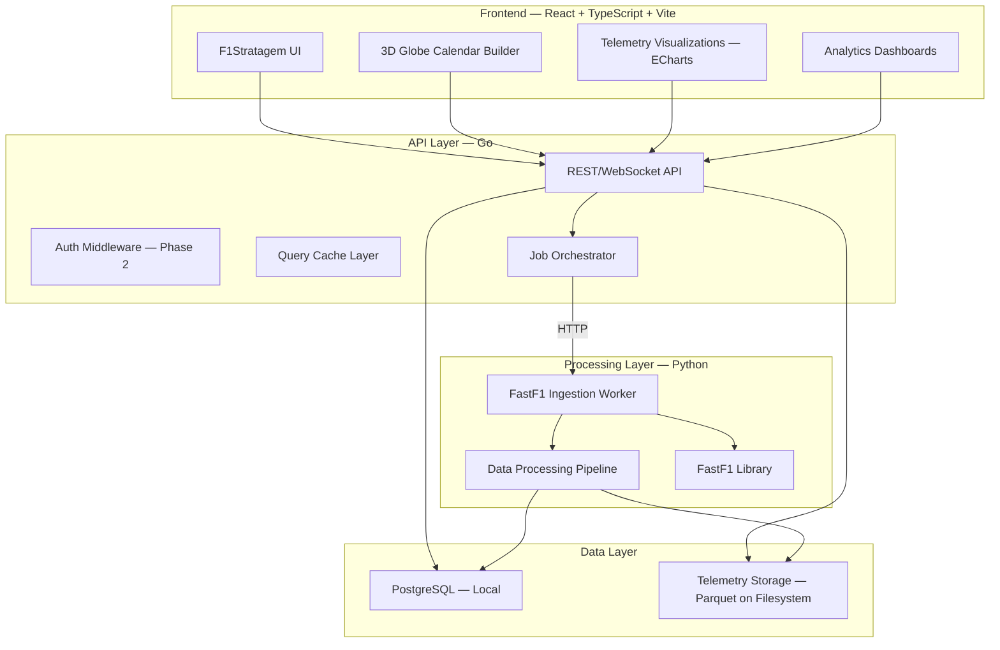
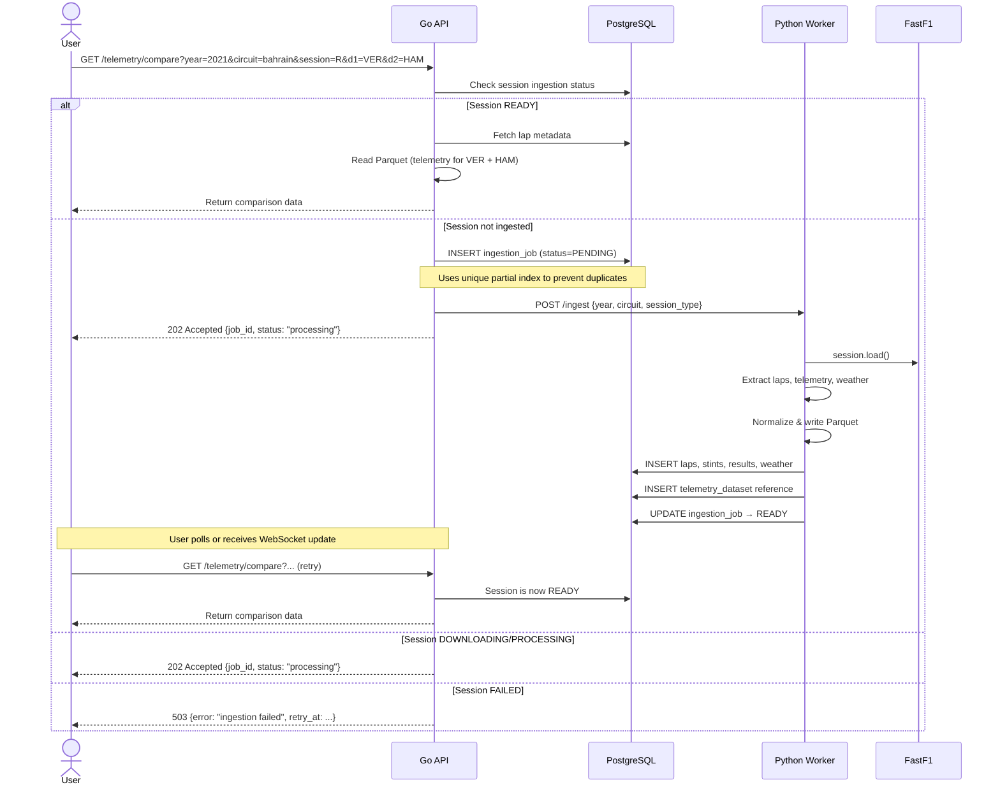

# F1Stratagem — Architecture & Implementation Plan

> **Status**: APPROVED — All decisions finalized.
> **Last updated**: 2026-09-11

---

## Finalized Decisions

| Decision | Choice | Rationale |
|----------|--------|-----------|
| **API Language** | **Go** | Faster iteration, goroutine concurrency, battle-tested PG/HTTP ecosystem. Rust overkill for a web API where the bottleneck is FastF1 I/O. |
| **Charting Library** | **Apache ECharts** | Canvas/WebGL rendering, handles 100k+ telemetry points, built-in glow/gradient/animation effects, dark theme, zoom/pan/brush, synchronized charts. D3.js reserved for custom visualizations (track maps, racing lines). |
| **Authentication** | **Phase 2** | Telemetry/analytics are fully public — no login required. Phase 2 introduces user accounts with JWT auth. Logged-in users get search/comparison history saved to their profile for easy lookback. |
| **PostgreSQL** | **Local installation** | More control during development. No Docker for PG locally. Docker/managed service considered at deployment time. |
| **Project Name** | **F1Stratagem** | Canonical name. Folder will be renamed from `F1Strategem` to `F1Stratagem`. |
| **Telemetry Data Range** | **2018 onwards** | FastF1 telemetry is only available from 2018+. Older seasons (back to 1950) will have results/standings data only via Jolpica-F1/Ergast API. Future alternative sources for older data can be integrated later. |

---

## Current State

The repository contains a minimal prototype in `backend/`:
- `pace_report.py` — fetches all races for a team+year via FastF1, computes average race pace, writes to a text file
- `pace_plot.py` — reads the text report and plots with matplotlib/seaborn
- `compare_pace.py` — compares two teams by parsing the same text report
- `main.py` — single-line script runner
- `frontend/` — empty directory

These scripts are standalone exploratory prototypes. **None of this code will carry over** into the production architecture — it uses text-file storage, synchronous blocking FastF1 calls, and matplotlib for rendering. The concepts (session loading, pace extraction, comparison) are valid and will be reimplemented properly.

---

## High-Level Architecture



### Component Responsibilities

| Component | Language | Purpose |
|-----------|----------|---------|
| **Frontend** | TypeScript/React | UI, visualizations, calendar builder |
| **API Server** | Go | HTTP API, WebSocket, job orchestration, cache coordination. Auth added in Phase 2. |
| **PostgreSQL** | — | Metadata, indexes, relational data, user data (Phase 2), calendar posts (Phase 2) |
| **Telemetry Storage** | — | Parquet files on local filesystem (abstracted for future S3/R2/B2) |
| **Ingestion Worker** | Python | FastF1 session downloads, data extraction, normalization |
| **Processing Pipeline** | Python | Telemetry processing, derived metrics, analytics computation |

### Why NOT a microservice split yet

The Go API and Python worker communicate via **HTTP**. They run as **two processes** but live in the same repository. This is a **modular monorepo**, not microservices. The boundary is clean enough that they could be separated into independent services later without any code changes — just deployment configuration.

---

## Repository Structure

```
F1Stratagem/
├── frontend/                    # React + TypeScript + Vite
│   ├── src/
│   │   ├── components/          # Shared UI components
│   │   ├── features/            # Feature modules
│   │   │   ├── telemetry/       # Telemetry comparison views
│   │   │   ├── drivers/         # Driver profiles & analysis
│   │   │   ├── teams/           # Team/car profiles
│   │   │   ├── circuits/        # Circuit intelligence
│   │   │   ├── races/           # Race analysis
│   │   │   ├── strategy/        # Strategy center
│   │   │   ├── calendar/        # Calendar builder
│   │   │   └── intelligence/    # F1 news/intelligence feed
│   │   ├── lib/                 # API client, utils, types
│   │   ├── hooks/               # Shared React hooks
│   │   ├── stores/              # State management (Zustand)
│   │   └── styles/              # Global styles, theme
│   ├── public/
│   ├── index.html
│   ├── vite.config.ts
│   ├── tailwind.config.ts
│   ├── tsconfig.json
│   └── package.json
│
├── api/                         # Go API server
│   ├── cmd/
│   │   └── server/
│   │       └── main.go          # Entry point
│   ├── internal/
│   │   ├── config/              # Configuration
│   │   ├── server/              # HTTP server setup, middleware
│   │   ├── handler/             # HTTP handlers (by domain)
│   │   │   ├── session.go
│   │   │   ├── telemetry.go
│   │   │   ├── driver.go
│   │   │   ├── team.go
│   │   │   ├── circuit.go
│   │   │   ├── race.go
│   │   │   ├── calendar.go
│   │   │   └── health.go
│   │   ├── service/             # Business logic
│   │   ├── repository/          # Database access (pgx)
│   │   ├── model/               # Domain types
│   │   ├── storage/             # Telemetry file storage abstraction
│   │   ├── worker/              # Job orchestration, Python worker client
│   │   └── middleware/          # Logging, rate limiting. Auth added Phase 2.
│   ├── migrations/              # SQL migrations
│   ├── go.mod
│   └── go.sum
│
├── worker/                      # Python processing worker
│   ├── src/
│   │   ├── main.py              # Worker HTTP server (FastAPI)
│   │   ├── ingestion/           # FastF1 session loading
│   │   │   ├── session.py       # Session download & extraction
│   │   │   ├── telemetry.py     # Telemetry extraction
│   │   │   ├── laps.py          # Lap data extraction
│   │   │   └── weather.py       # Weather data extraction
│   │   ├── processing/          # Data normalization & derived metrics
│   │   │   ├── normalize.py     # Normalization pipeline
│   │   │   ├── sectors.py       # Sector analysis
│   │   │   ├── stints.py        # Stint analysis
│   │   │   └── comparisons.py   # Comparison calculations
│   │   ├── storage/             # Parquet file I/O
│   │   │   ├── writer.py        # Write processed data
│   │   │   └── reader.py        # Read cached data
│   │   ├── models/              # Pydantic models
│   │   └── config.py            # Configuration
│   ├── requirements.txt
│   └── pyproject.toml
│
├── data/                        # Telemetry file storage (gitignored)
│   └── f1/
│       └── telemetry/
│           └── {year}/
│               └── {circuit_key}/
│                   └── {session_type}.parquet
│
├── Makefile                     # Common commands
├── .env.example                 # Environment template
├── .gitignore
└── README.md
```

> **Note**: No `docker-compose.yml` for development. PostgreSQL runs locally. Docker/compose may be introduced at deployment time.

---

## PostgreSQL Schema (High-Level)

### Core F1 Domain

```sql
-- Seasons
CREATE TABLE seasons (
    year        INT PRIMARY KEY,
    created_at  TIMESTAMPTZ DEFAULT now()
);

-- Circuits
CREATE TABLE circuits (
    id              SERIAL PRIMARY KEY,
    circuit_key     TEXT UNIQUE NOT NULL,    -- e.g., "bahrain", "monza"
    name            TEXT NOT NULL,           -- "Bahrain International Circuit"
    country         TEXT NOT NULL,
    city            TEXT,
    latitude        DOUBLE PRECISION,
    longitude       DOUBLE PRECISION,
    altitude_m      DOUBLE PRECISION,
    track_length_m  DOUBLE PRECISION,
    num_corners     INT,
    first_gp_year   INT,
    created_at      TIMESTAMPTZ DEFAULT now(),
    updated_at      TIMESTAMPTZ DEFAULT now()
);

-- Circuit configurations (track layout changes over time)
CREATE TABLE circuit_configurations (
    id              SERIAL PRIMARY KEY,
    circuit_id      INT REFERENCES circuits(id),
    config_name     TEXT,                   -- "Grand Prix", "Short", "Sprint"
    valid_from      INT NOT NULL,           -- year
    valid_to        INT,                    -- year (NULL = current)
    track_length_m  DOUBLE PRECISION,
    num_corners     INT,
    num_drs_zones   INT,
    layout_data     JSONB,                  -- corner positions, sector boundaries
    created_at      TIMESTAMPTZ DEFAULT now()
);

-- Events (race weekends)
CREATE TABLE events (
    id              SERIAL PRIMARY KEY,
    year            INT REFERENCES seasons(year),
    round_number    INT NOT NULL,
    event_key       TEXT NOT NULL,           -- e.g., "bahrain-2021"
    event_name      TEXT NOT NULL,           -- "Bahrain Grand Prix"
    circuit_id      INT REFERENCES circuits(id),
    event_format    TEXT NOT NULL,           -- "conventional", "sprint", "sprint_shootout"
    date_start      DATE,
    date_end        DATE,
    created_at      TIMESTAMPTZ DEFAULT now(),
    UNIQUE(year, round_number)
);

-- Sessions within events
CREATE TABLE sessions (
    id              SERIAL PRIMARY KEY,
    event_id        INT REFERENCES events(id),
    session_type    TEXT NOT NULL,           -- "FP1","FP2","FP3","Q","SQ","SS","S","R"
    session_name    TEXT NOT NULL,           -- "Practice 1", "Qualifying", "Race"
    date_start      TIMESTAMPTZ,
    date_end        TIMESTAMPTZ,
    created_at      TIMESTAMPTZ DEFAULT now(),
    UNIQUE(event_id, session_type)
);

-- Drivers
CREATE TABLE drivers (
    id              SERIAL PRIMARY KEY,
    driver_code     TEXT NOT NULL,           -- "VER", "HAM"
    first_name      TEXT NOT NULL,
    last_name       TEXT NOT NULL,
    full_name       TEXT NOT NULL,
    nationality     TEXT,
    date_of_birth   DATE,
    driver_number   INT,
    created_at      TIMESTAMPTZ DEFAULT now(),
    UNIQUE(driver_code)
);

-- Teams
CREATE TABLE teams (
    id              SERIAL PRIMARY KEY,
    team_key        TEXT UNIQUE NOT NULL,    -- "red_bull"
    name            TEXT NOT NULL,           -- "Red Bull Racing"
    created_at      TIMESTAMPTZ DEFAULT now()
);

-- Team names change over seasons
CREATE TABLE team_seasons (
    id              SERIAL PRIMARY KEY,
    team_id         INT REFERENCES teams(id),
    year            INT REFERENCES seasons(year),
    display_name    TEXT NOT NULL,           -- "Oracle Red Bull Racing"
    color           TEXT,                    -- team color hex
    UNIQUE(team_id, year)
);

-- Driver-team relationships per season
CREATE TABLE driver_seasons (
    id              SERIAL PRIMARY KEY,
    driver_id       INT REFERENCES drivers(id),
    team_id         INT REFERENCES teams(id),
    year            INT REFERENCES seasons(year),
    is_primary      BOOLEAN DEFAULT true,
    UNIQUE(driver_id, year)
);
```

### Session Data (Metadata in PG, heavy data in Parquet)

```sql
-- Lap data (stored in PG — relatively small per session)
CREATE TABLE laps (
    id              BIGSERIAL PRIMARY KEY,
    session_id      INT REFERENCES sessions(id),
    driver_id       INT REFERENCES drivers(id),
    lap_number      INT NOT NULL,
    lap_time_ms     INT,                    -- milliseconds
    sector1_ms      INT,
    sector2_ms      INT,
    sector3_ms      INT,
    speed_trap      DOUBLE PRECISION,
    speed_fl        DOUBLE PRECISION,       -- finish line speed
    speed_st        DOUBLE PRECISION,       -- speed trap
    compound        TEXT,                   -- "SOFT", "MEDIUM", "HARD", etc.
    tyre_life       INT,                    -- laps on this set
    stint_number    INT,
    is_personal_best BOOLEAN,
    is_deleted       BOOLEAN DEFAULT false,
    deleted_reason   TEXT,
    pit_in_time_ms   INT,
    pit_out_time_ms  INT,
    track_status     TEXT,
    position         INT,
    created_at       TIMESTAMPTZ DEFAULT now()
);

CREATE INDEX idx_laps_session_driver ON laps(session_id, driver_id);
CREATE INDEX idx_laps_session_lap ON laps(session_id, lap_number);

-- Stint summary
CREATE TABLE stints (
    id              SERIAL PRIMARY KEY,
    session_id      INT REFERENCES sessions(id),
    driver_id       INT REFERENCES drivers(id),
    stint_number    INT NOT NULL,
    compound        TEXT NOT NULL,
    start_lap       INT NOT NULL,
    end_lap         INT NOT NULL,
    num_laps        INT NOT NULL,
    avg_lap_time_ms INT,
    created_at      TIMESTAMPTZ DEFAULT now()
);

-- Session results
CREATE TABLE session_results (
    id              SERIAL PRIMARY KEY,
    session_id      INT REFERENCES sessions(id),
    driver_id       INT REFERENCES drivers(id),
    team_id         INT REFERENCES teams(id),
    position        INT,
    grid_position   INT,
    points          DOUBLE PRECISION,
    status          TEXT,                   -- "Finished", "+1 Lap", "Retired"
    fastest_lap_rank INT,
    q1_time_ms      INT,
    q2_time_ms      INT,
    q3_time_ms      INT,
    created_at      TIMESTAMPTZ DEFAULT now(),
    UNIQUE(session_id, driver_id)
);

-- Weather data per session
CREATE TABLE weather_data (
    id              SERIAL PRIMARY KEY,
    session_id      INT REFERENCES sessions(id),
    timestamp       TIMESTAMPTZ,
    air_temp_c      DOUBLE PRECISION,
    track_temp_c    DOUBLE PRECISION,
    humidity_pct    DOUBLE PRECISION,
    pressure_mbar   DOUBLE PRECISION,
    wind_speed_ms   DOUBLE PRECISION,
    wind_direction  INT,                    -- degrees
    rainfall        BOOLEAN,
    created_at      TIMESTAMPTZ DEFAULT now()
);
```

### Telemetry Storage References

```sql
-- References to Parquet files (heavy telemetry stays OUT of PG)
CREATE TABLE telemetry_datasets (
    id              SERIAL PRIMARY KEY,
    session_id      INT REFERENCES sessions(id),
    dataset_type    TEXT NOT NULL,           -- "car_telemetry", "position", "combined"
    storage_path    TEXT NOT NULL,           -- "telemetry/2021/bahrain/race.parquet"
    file_size_bytes BIGINT,
    row_count       INT,
    format          TEXT DEFAULT 'parquet',
    source          TEXT DEFAULT 'fastf1',
    source_version  TEXT,
    processing_version TEXT,
    created_at      TIMESTAMPTZ DEFAULT now(),
    updated_at      TIMESTAMPTZ DEFAULT now(),
    UNIQUE(session_id, dataset_type)
);
```

### Ingestion & Cache State Machine

```sql
-- Session ingestion tracking
CREATE TABLE ingestion_jobs (
    id              SERIAL PRIMARY KEY,
    session_id      INT REFERENCES sessions(id),
    status          TEXT NOT NULL DEFAULT 'PENDING',
    -- States: PENDING → DOWNLOADING → PROCESSING → READY | FAILED
    requested_by    TEXT,                   -- user ID or "anonymous"
    requested_at    TIMESTAMPTZ DEFAULT now(),
    started_at      TIMESTAMPTZ,
    completed_at    TIMESTAMPTZ,
    failed_at       TIMESTAMPTZ,
    error_message   TEXT,
    retry_count     INT DEFAULT 0,
    fastf1_version  TEXT,
    processing_version TEXT,
    created_at      TIMESTAMPTZ DEFAULT now(),
    updated_at      TIMESTAMPTZ DEFAULT now()
);

CREATE UNIQUE INDEX idx_ingestion_active
    ON ingestion_jobs(session_id)
    WHERE status IN ('PENDING', 'DOWNLOADING', 'PROCESSING');
-- This prevents duplicate active jobs for the same session
```

### Calendar Builder (Phase 2)

```sql
-- Calendar posts
CREATE TABLE calendar_posts (
    id              UUID PRIMARY KEY DEFAULT gen_random_uuid(),
    author_id       INT REFERENCES users(id),
    title           TEXT NOT NULL,
    description     TEXT,                   -- user's explanation of WHY they designed it this way
    is_featured     BOOLEAN DEFAULT false,  -- pinned/featured mechanism
    is_published    BOOLEAN DEFAULT false,
    num_races       INT NOT NULL,
    has_rotations   BOOLEAN DEFAULT false,
    num_permanent   INT,
    num_rotational  INT,
    calendar_rules  JSONB,                  -- constraints config
    logistics_score DOUBLE PRECISION,
    total_distance_km DOUBLE PRECISION,
    created_at      TIMESTAMPTZ DEFAULT now(),
    updated_at      TIMESTAMPTZ DEFAULT now()
);

-- Calendar entries (individual race slots)
CREATE TABLE calendar_entries (
    id              SERIAL PRIMARY KEY,
    calendar_id     UUID REFERENCES calendar_posts(id) ON DELETE CASCADE,
    slot_number     INT NOT NULL,
    circuit_id      INT REFERENCES circuits(id),
    is_permanent    BOOLEAN DEFAULT true,
    scheduled_month INT,                    -- preferred month (1-12)
    scheduled_week  INT,                    -- preferred week
    created_at      TIMESTAMPTZ DEFAULT now()
);

-- Rotation pairs
CREATE TABLE calendar_rotations (
    id              SERIAL PRIMARY KEY,
    calendar_id     UUID REFERENCES calendar_posts(id) ON DELETE CASCADE,
    slot_number     INT NOT NULL,
    circuit_a_id    INT REFERENCES circuits(id),
    circuit_b_id    INT REFERENCES circuits(id),
    geo_distance_km DOUBLE PRECISION,       -- distance between alternatives
    generates_variants BOOLEAN DEFAULT false,
    variant_threshold TEXT,                  -- why variants were/weren't generated
    created_at      TIMESTAMPTZ DEFAULT now()
);

-- Calendar variants (auto-generated when rotation pairs have large geo diff)
CREATE TABLE calendar_variants (
    id              SERIAL PRIMARY KEY,
    calendar_id     UUID REFERENCES calendar_posts(id) ON DELETE CASCADE,
    variant_label   TEXT NOT NULL,           -- "Variant A", "Variant B"
    description     TEXT,
    race_sequence   JSONB NOT NULL,          -- ordered list of circuit_ids
    total_distance_km DOUBLE PRECISION,
    logistics_score DOUBLE PRECISION,
    created_at      TIMESTAMPTZ DEFAULT now()
);

-- Users (Phase 2)
CREATE TABLE users (
    id              SERIAL PRIMARY KEY,
    username        TEXT UNIQUE NOT NULL,
    display_name    TEXT,
    email           TEXT UNIQUE,
    password_hash   TEXT,
    created_at      TIMESTAMPTZ DEFAULT now()
);

-- Search/comparison history for logged-in users (Phase 2)
CREATE TABLE user_search_history (
    id              SERIAL PRIMARY KEY,
    user_id         INT REFERENCES users(id) ON DELETE CASCADE,
    search_type     TEXT NOT NULL,           -- "telemetry_comparison", "lap_analysis", etc.
    search_params   JSONB NOT NULL,          -- full query parameters
    display_label   TEXT NOT NULL,           -- "VER vs HAM — Bahrain 2021 Qualifying"
    created_at      TIMESTAMPTZ DEFAULT now()
);

CREATE INDEX idx_search_history_user ON user_search_history(user_id, created_at DESC);
```

### Regulation Eras

```sql
CREATE TABLE regulation_eras (
    id              SERIAL PRIMARY KEY,
    name            TEXT NOT NULL,           -- "V6 Hybrid", "Ground Effect 2022"
    era_type        TEXT NOT NULL,           -- "technical", "tyre", "aero", "sporting"
    year_start      INT NOT NULL,
    year_end        INT,                     -- NULL = current
    description     TEXT,
    key_changes     JSONB,
    created_at      TIMESTAMPTZ DEFAULT now()
);
```

---

## Telemetry Storage Layout

```
data/f1/
└── telemetry/
    └── {year}/
        └── {circuit_key}/
            ├── fp1_car_data.parquet         # Car telemetry (speed, RPM, gear, throttle, brake, DRS)
            ├── fp1_position.parquet          # Position data (X, Y, Z coordinates)
            ├── fp2_car_data.parquet
            ├── fp2_position.parquet
            ├── fp3_car_data.parquet
            ├── fp3_position.parquet
            ├── qualifying_car_data.parquet
            ├── qualifying_position.parquet
            ├── race_car_data.parquet
            └── race_position.parquet
```

**Parquet schema** (per file):

| Column | Type | Description |
|--------|------|-------------|
| `driver_number` | INT32 | Car number |
| `timestamp_ms` | INT64 | Session-relative timestamp |
| `distance_m` | FLOAT64 | Distance around lap |
| `speed_kmh` | FLOAT64 | Speed |
| `rpm` | INT32 | Engine RPM |
| `gear` | INT8 | Gear number |
| `throttle_pct` | FLOAT64 | Throttle (0-100) |
| `brake` | BOOLEAN | Brake applied |
| `drs` | INT8 | DRS status |
| `x` | FLOAT64 | Position X |
| `y` | FLOAT64 | Position Y |
| `z` | FLOAT64 | Position Z (elevation) |
| `lap_number` | INT32 | Lap number |

### Storage Abstraction (Go)

```go
// storage/provider.go
type StorageProvider interface {
    Write(ctx context.Context, path string, data []byte) error
    Read(ctx context.Context, path string) ([]byte, error)
    Exists(ctx context.Context, path string) (bool, error)
    Delete(ctx context.Context, path string) error
    List(ctx context.Context, prefix string) ([]string, error)
}

// Phase 1: LocalFileStorage only
// Future: S3Storage, R2Storage, B2Storage
```

This interface ensures switching from local filesystem to S3/R2/B2 requires **zero changes** to any business logic — only a configuration change.

---

## Session-Level Caching & Ingestion Workflow

This is the heart of the system. The flow ensures session data is fetched once and reused forever.



### Key Guarantees

1. **No duplicate downloads** — The `UNIQUE` partial index on `ingestion_jobs` prevents two users from triggering the same download. The second user gets the existing job's status.
2. **Session-level caching** — Data is cached at the session level (e.g., "2021 Bahrain Race"), not at the comparison level. Any driver combination against that session reuses the same underlying data.
3. **Non-blocking** — Large FastF1 downloads happen in the Python worker, not in the API request handler. Users get immediate feedback.
4. **Reprocessing** — If the processing pipeline changes, we can mark old datasets for reprocessing and re-run the worker. The `processing_version` field tracks this.

### Caching Example Walkthrough

**User 1**: Verstappen vs Hamilton, Bahrain 2021
- System checks: no session data → triggers FastF1 download for 2021 Bahrain Race
- Downloads ALL driver data for that session (not just VER/HAM)
- Stores laps for ALL drivers in PostgreSQL
- Stores telemetry for ALL drivers in one Parquet file
- Returns VER vs HAM comparison

**User 2**: Verstappen vs Leclerc, Bahrain 2021
- System checks: session data READY → reads from existing Parquet + PG
- Filters for VER and LEC data — no download needed
- Near-instant response

**User 3**: Leclerc vs Hamilton, Bahrain 2021
- Same — instant response from cached session data

---

## FastF1 Integration Details

### How FastF1 works internally
- `fastf1.get_session(year, event, session_type)` creates a Session object
- `session.load()` downloads timing data, telemetry, weather from F1's servers (can take 10-60 seconds)
- FastF1 has its own disk cache (`fastf1.Cache.enable_cache(path)`) for raw API responses
- Data is returned as Pandas DataFrames
- **Telemetry data available from 2018 onwards only**
- Schedule/results data available back to 1950 via Jolpica-F1 (Ergast) API

### Our integration strategy

```
FastF1's raw cache (speed up repeated downloads)
        ↓
Our extraction layer (pull structured data from Session object)
        ↓
Our normalization layer (clean, type-safe, consistent schema)
        ↓
Two outputs:
    → PostgreSQL (laps, stints, results, weather — queryable metadata)
    → Parquet files (telemetry time-series — analytical workload)
```

We keep FastF1's own cache enabled for raw response caching, but we **also** store our own processed data. This means:
- First download: FastF1 fetches from F1 servers → we process → store
- If FastF1 cache is warm: FastF1 reads from disk → we process → store (faster)
- If our processed data exists: Skip FastF1 entirely → read from PG + Parquet (fastest)

### What we extract from each session

| Data | Storage | Source |
|------|---------|--------|
| Lap times, sectors, compounds | PostgreSQL `laps` table | `session.laps` |
| Stint info | PostgreSQL `stints` table | Derived from `session.laps` |
| Session results | PostgreSQL `session_results` | `session.results` |
| Weather | PostgreSQL `weather_data` | `session.weather_data` |
| Car telemetry | Parquet file | `lap.get_car_data()` per driver |
| Position data | Parquet file | `lap.get_pos_data()` per driver |
| Track status | PostgreSQL (future) | `session.track_status` |
| Race control messages | PostgreSQL (future) | `session.race_control_messages` |
| Circuit info | PostgreSQL `circuits` | `session.get_circuit_info()` |

---

## API Structure

### Go API — Route Design

```
/api/v1/
├── /health                          GET     — Health check
│
├── /seasons                         GET     — List available seasons
├── /seasons/{year}/events           GET     — List events for a season
├── /events/{id}                     GET     — Event detail
├── /events/{id}/sessions            GET     — Sessions for an event
│
├── /sessions/{id}                   GET     — Session detail + ingestion status
├── /sessions/{id}/laps              GET     — All laps (filterable by driver)
├── /sessions/{id}/results           GET     — Session results
├── /sessions/{id}/stints            GET     — Stint data
├── /sessions/{id}/weather           GET     — Weather data
│
├── /telemetry/compare               GET     — Telemetry comparison
│   ?session_id=...&drivers=VER,HAM&laps=fastest
├── /telemetry/lap                   GET     — Single lap telemetry
│   ?session_id=...&driver=VER&lap=42
│
├── /drivers                         GET     — List drivers
├── /drivers/{code}                  GET     — Driver profile
├── /drivers/{code}/seasons          GET     — Driver's seasons
│
├── /teams                           GET     — List teams
├── /teams/{key}                     GET     — Team profile
│
├── /circuits                        GET     — List circuits
├── /circuits/{key}                  GET     — Circuit detail
│
├── /ingestion/status/{job_id}       GET     — Check ingestion job status
├── /ingestion/trigger               POST    — Manually trigger ingestion
│
│── ── Phase 2 Routes ── ──
│
├── /auth/register                   POST    — User registration
├── /auth/login                      POST    — User login (JWT)
├── /auth/me                         GET     — Current user profile
│
├── /user/history                    GET     — Search/comparison history
├── /user/history                    POST    — Save a search to history
│
├── /calendar/posts                  GET     — List calendar posts
├── /calendar/posts                  POST    — Create calendar post (auth required)
├── /calendar/posts/{id}             GET     — Get calendar post with variants
├── /calendar/posts/{id}             PUT     — Update calendar post (auth required)
├── /calendar/posts/featured         GET     — Get featured calendar
├── /calendar/circuits               GET     — Available circuits for calendar
├── /calendar/logistics              POST    — Calculate logistics score
│
└── /ws/ingestion/{job_id}           WS      — Real-time ingestion updates
```

### Python Worker — Internal API (not exposed to frontend)

```
POST /ingest/session
    { year, circuit_key, session_type }
    → Downloads, processes, stores data
    → Returns {job_id, status}

GET /ingest/status/{job_id}
    → Returns current processing state

POST /process/comparison
    { session_id, driver_codes, lap_selection }
    → Reads cached Parquet, computes comparison
    → Returns processed comparison data

GET /health
    → Worker health + FastF1 version
```

---

## Frontend Architecture

### Tech Stack

| Technology | Purpose |
|------------|---------|
| **React 19** | UI framework |
| **TypeScript** | Type safety |
| **Vite** | Build tool |
| **TailwindCSS v4** | Styling |
| **React Router v7** | Routing |
| **TanStack Query** | Server state, caching, polling |
| **Zustand** | Client state |
| **Apache ECharts** | Telemetry graphs & charts (Canvas/WebGL, glow effects, gradients, animations, 100k+ points) |
| **D3.js** | Custom visualizations only — track maps, racing line overlays |
| **Three.js + React Three Fiber** | 3D globe for calendar builder (Phase 2) |
| **Framer Motion** | Animations & micro-interactions |

### Why Apache ECharts

- **Canvas/WebGL rendering** — handles 100k+ telemetry data points smoothly
- **Built-in glow effects** — `shadowBlur`, `shadowColor` on every series element
- **Gradient fills** — `LinearGradient` and `RadialGradient` on lines, areas, bars, backgrounds
- **30+ animation easings** — smooth animated transitions, staggered reveals
- **Full color control** — every bar, line, dot, axis, grid line individually colorable, including per-data-point
- **DataZoom** — smooth brush/zoom for exploring telemetry with minimap preview
- **Synchronized charts** — speed, throttle, brake, gear aligned and linked
- **Dark theme** — built-in, fully customizable
- **React integration** — `echarts-for-react` wrapper

D3.js is reserved for truly custom visualizations where ECharts' chart types don't apply (racing line overlays, track maps, custom canvas work).

### Why Three.js + React Three Fiber for the Globe (Phase 2)

The calendar builder needs an interactive 3D globe where users:
- See all F1 circuits labeled on a rotating globe
- Click a country → see available tracks
- Drag tracks from the globe into their calendar
- See travel routes drawn between selected circuits
- Get real-time logistics visualization as they build

React Three Fiber is the standard React wrapper for Three.js. Combined with custom globe geometry, it delivers a premium interactive experience.

### Page Structure

```
/                               → Landing / Dashboard
/telemetry                      → Session browser → telemetry comparison
/telemetry/:sessionId           → Session telemetry view
/drivers                        → Driver index
/drivers/:code                  → Driver DNA profile
/teams                          → Team index
/teams/:key                     → Team/car profile
/circuits                       → Circuit index
/circuits/:key                  → Circuit intelligence
/races/:year                    → Season overview
/races/:year/:round             → Race analysis
/strategy                       → Strategy center (Phase 4)
/intelligence                   → F1 news feed (Phase 5)
/predictions                    → Prediction center (Phase 5)
/calendar                       → Calendar browser (Phase 2)
/calendar/create                → Calendar builder with globe (Phase 2)
/calendar/:id                   → Calendar post detail (Phase 2)
```

---

## MVP Scope — Phase 1

The smallest useful, shippable version of the platform. **No authentication required** — all data is publicly accessible.

### What's in the MVP

1. **Infrastructure**
   - PostgreSQL database (local) with core schema (seasons, circuits, events, sessions, drivers, teams, laps)
   - Go API server with health check and CRUD endpoints
   - Python FastF1 worker with session ingestion
   - Telemetry storage on local filesystem as Parquet
   - Storage abstraction interface (implemented for local FS only)

2. **Session Ingestion Pipeline**
   - Lazy-loading: user requests a session → if not cached → fetch via FastF1
   - Session-level caching with deduplication
   - Cache state machine (PENDING → DOWNLOADING → PROCESSING → READY | FAILED)
   - Ingestion status polling endpoint + WebSocket updates

3. **Core Telemetry Feature**
   - Season → Event → Session browser
   - Driver vs Driver telemetry comparison
     - Speed, throttle, brake, gear, RPM, DRS over distance
   - Lap selection (fastest lap, specific lap number)
   - Synchronized telemetry charts (ECharts with glow effects, gradients, animations)

4. **Basic Race Analysis**
   - Lap time chart
   - Session results table
   - Stint/tyre strategy visualization
   - Weather data display

5. **Frontend Shell**
   - Premium dark theme, responsive layout
   - Navigation sidebar
   - Season/event/session selector
   - Telemetry comparison view with ECharts
   - Loading states for ingestion (animated progress)

### What's NOT in the MVP

| Feature | Phase |
|---------|-------|
| Calendar builder (3D globe) | Phase 2 |
| User accounts & auth (JWT) | Phase 2 |
| Search/comparison history | Phase 2 |
| Driver DNA profiles | Phase 3 |
| Team/car profiles | Phase 3 |
| Circuit intelligence | Phase 3 |
| Weather provider integration | Phase 3 |
| Strategy center | Phase 4 |
| Prediction engine | Phase 5 |
| RAG/intelligence system | Phase 5 |
| Scenario simulator | Phase 6 |

---

## Implementation Roadmap

| Phase | Focus | Key Deliverables |
|-------|-------|-------------------|
| **Phase 1** | Core Infrastructure + Telemetry | DB schema, Go API, Python worker, session ingestion, telemetry comparison, ECharts frontend, dark theme shell |
| **Phase 2** | Calendar Builder + User System | 3D globe, drag-and-drop calendar, rotation system, variant generation, user auth (JWT), calendar posts, search history |
| **Phase 3** | Deep Analytics | Driver profiles, team profiles, circuit intelligence, sector analysis, corner analysis, historical comparisons, weather provider abstraction |
| **Phase 4** | Strategy & Weather | Strategy center, tyre analysis, weather integration, stint intelligence, pit window analysis |
| **Phase 5** | Intelligence & Prediction | RAG system, F1 news feed, prediction engine, qualifying/race prediction |
| **Phase 6** | Advanced Simulation | Scenario simulator, what-if analysis, dynamic race modeling |

Each phase is independently useful. The platform is runnable and valuable after Phase 1.

---

## Verification Plan

### After Phase 1 Implementation

**Automated**:
- `go test ./...` — API unit and integration tests
- `pytest` — Worker unit tests
- Database migration verification

**Manual**:
- Navigate Season → Event → Session in the UI
- Trigger a session ingestion (e.g., 2024 Bahrain Qualifying)
- Watch ingestion status transition through states
- View telemetry comparison (VER vs HAM) with synchronized ECharts
- Verify session-level caching: request different driver pair for same session — should be instant
- Verify dark theme renders correctly across all views
- Verify responsive layout on different screen sizes
